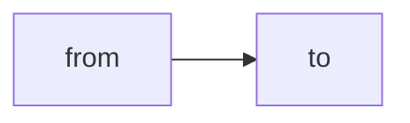
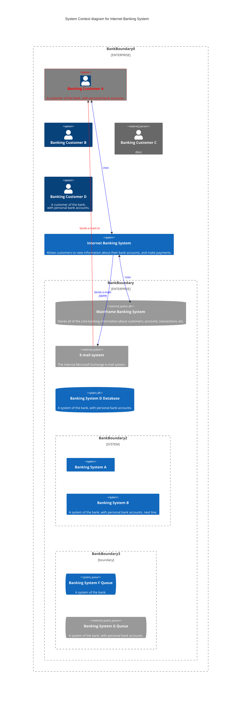

**Bing Image Creator**: `Create a hello world image for a cloud technology blog that includes the text "hello world", futurism`

Firstly, I would like to thank the AI for rendering a Death Star to describe this blog ;). Hopefully the obedience and accuracy of generative content can improve along with my own writing and technical knowledge as this blog evolves.

## About Me

As a "_jack of many trades_" in an IT context, I find the most impactful roles are cross-functional and able to make use of my 24 years experience across IT Operations, Security, Architecture and Software Development roles to understand a context and ensure innovation comes at pace with high chances of success.

## Motivation

The idea of hosting my own blog on technical topics has been going through my head using the very Kiwi "_Yeah, Nah_" process for a while. 
- Do I have time for that?
- Will others be interested in what I have to say? 

Ultimately, I need my own place to review what I have previously discovered in any case and in a world of faster and faster evolution of digital technologies with the advent of the public and commercial Internet, open and crowd-sourcing and cloud computing over the span of my career sharing learnings and discoveries in a concise and practical way cannot be more important.


Github style task list?

- [ ] not done
- [x] done
- [ ] az
- [x] za
- [x] aaa
  - [x] bbb
    - [x] ccc
  - [x] ddd




Now that mermaid is running, lets check some newer diagram types, because I really like the C4 architectural model:

:::bestpractice
**BEST:** Notes best practices/way in the opinion of the author
:::

:::information
**INFO:** This is an informational text container
:::

:::warning
**WARNING:** This is a warning text container
:::

:::attention
**ATTENTION:** This is an alarm or error text container
:::

## Code for fun or profit

Having good looking (totally opiniated here, no) code snippets is mandatory. At least for myself. The included Prism config is based on [this selection](https://prismjs.com/download.html#themes=prism-coy&languages=markup+css+clike+javascript+bash+docker+java+regex+ruby+rust+scala+shell-session+typescript&plugins=show-language+toolbar). No standard theme has been chosen, there are some modifications to fit the Chirpy UX.

Find here an excerpt of the visuals.

### Bash

```bash
if [ -z "$HEROKU_PWA_APP_NAME" ]; then
    echo "Please provide HEROKU_PWA_APP_NAME environment variable"
    exit 1
fi
```


### JavaScript

```javascript
const jestLwcConfig = require("@lwc/jest-preset");
import { resolve } from "path";

export const jestConfig = {
    jestLwcConfig,
    resolver: resolve(__dirname, "../utils/resolver.js")
};
```


## Images, images, images

First, you'll notice this stunning picture. I got it royalty-free from Pixabay (great site). Now, that's not the point that I want to make here. The image is not added via Markdown, but instead via the `image` value of the Markdown front matter. As it's always good IMHO to start with a visual you'll get a standardized way of addding an image asset.

Second, the image is optimized for your browser size _and_ browser. Depending on what you currently use as browser you'll get i. e. a JPG or a WebP file. All in the right size for the screen. Obviously, all images have standard settings for lazy loading etc.

## Headings all over the place

It's all standard markdown to render the headings, and as well to display the table of contents (TOC) on the right side.

Note: never ever add a first level heading (aka: `h1`) to your page. This will break accessibility, as the title is already an h1, and will be represented as such in the rendered HTML.

## Other stuff

As to be expected you can do all the things that are _standard_ Markdown. So tables, blockquotes etc. And if you prefer to add custom Markdown functionality, just extend the configuration with custom [markdown-it](https://github.com/markdown-it/markdown-it) plugins.
